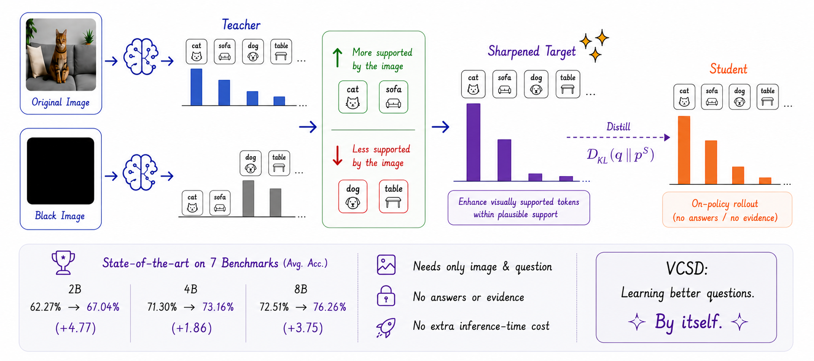
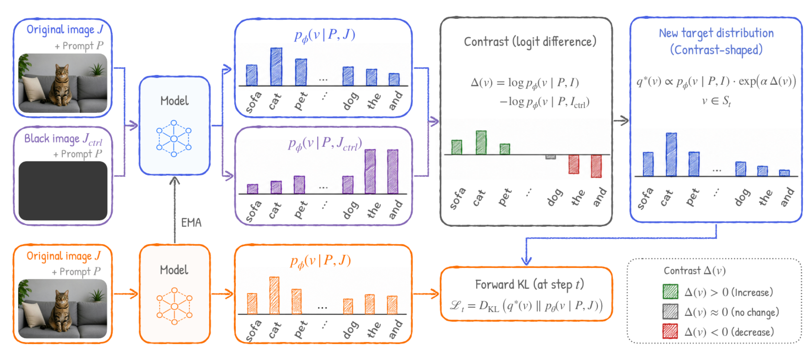

# Visual Contrast Self-Distillation (VCSD)


Code for our work-in-progress paper **Visual Contrast Self-Distillation for Vision-Language
Models**.

[**Paper**](https://arxiv.org/abs/2607.21556) | [**Project Page**](https://joliang17.github.io/VisualCSD/)

> 🚧 **Work in progress.** Both the **paper and the code are still in progress**  and this repository is under active development (code, configs, and documentation may change; some components are still being cleaned up and released). Please check back for updates.


## Highlights

🎯 Self-Distillation from a Visual Contrast: The model teaches itself by contrasting its own teacher pass on the real image against a control pass (image removed / blacked-out / degraded), sharpening exactly the predictions that depend on seeing the image.

🧭 Plausibility-Guarded Target: The contrast-sharpened target is restricted to the teacher's β-plausibility set, so probability mass is only redistributed among tokens the plain teacher already finds plausible — the student is never taught a token the teacher would not produce.

⚙️ Minimal, Drop-in RL Objective: A single token-averaged full-vocab KL toward the contrast target (no per-token reweighting, no gating) added to a standard GRPO/PPO loop — a few files on top of an inherited [verl](https://github.com/volcengine/verl) trainer.


## Method Overview


For each response token, VCSD forms a contrast-sharpened distillation target

```
target = softmax( anchor · log p_hi + α · (log p_hi − log p_ctrl) )   over  { w : p_hi(w) ≥ β · max p_hi }
```

where `p_hi` is the EMA-teacher distribution on the real image and `p_ctrl` is the teacher
distribution on a control input (image removed / blacked-out / degraded). The tilt `α·(log p_hi −
log p_ctrl)` amplifies exactly the tokens that change when the image is present, and the
β-plausibility mask confines the support to tokens the plain teacher already considers plausible.
The student is trained toward this target with a plain **token-averaged full-vocab KL** over the
response mask, alongside the RL objective.

The method-specific code is small; everything under `verl/` is the inherited RL framework:

| File | Role |
|---|---|
| `verl/trainer/ppo/vcsd.py` | `build_contrast_target` + token-averaged `vcsd_kd_loss` |
| `verl/workers/actor/dp_actor.py` | teacher hi/ctrl forward passes + distillation loss call |
| `verl/workers/config/actor.py`, `verl/trainer/config/actor/actor.yaml` | `vcsd_*` config knobs |
| `scripts/run_experiment_contrast_standard.sh` | training launcher (α=1.0, β=0.1, black-image control) |


## Repository Structure

```text
VCSD/
|-- verl/                                       # inherited GRPO/PPO RL framework
|   |-- trainer/
|   |   |-- ppo/vcsd.py                          # VCSD contrast target + KD loss
|   |   `-- config/vopd.yaml                     # training config (hydra)
|   `-- workers/
|       |-- actor/dp_actor.py                    # teacher passes + loss call
|       `-- config/actor.py                      # vcsd_* config schema
|-- scripts/
|   |-- run_experiment_contrast_standard.sh      # VCSD training launcher
|   |-- run_vcsd.sh                              # underlying training entry point
|   |-- prepare_answer_val_split.py              # data prep
|   |-- prepare_degraded_images.py               # degrade-control image prep
|   `-- mcq_exact_reward.py                      # reward helper
|-- chat_templates/
|-- requirements.txt
|-- pyproject.toml
`-- LICENSE
```


## Setup

```bash
pip install -e .
pip install -r requirements.txt
```

Requires a CUDA GPU stack compatible with the pinned `torch` / `vllm` / `flash-attn` in
`requirements.txt` (see the notes there for building flash-attn / causal-conv1d from source).


## Data

Training expects Parquet files under a `DATA_DIR` (default `data/`):

- `train.parquet` — training prompts with an image column
- `train_answer.parquet` / `val_answer.parquet` — answer-conditioned validation splits

Prepare helpers live in `scripts/` (`prepare_answer_val_split.py`, `prepare_degraded_images.py`).
Model checkpoints, datasets, caches, and generated outputs are intentionally **not** included in
this repository — point `TASK_TRAIN_FILE` / `ANSWER_VAL_TRAIN_FILE` at your own Parquet files.


## Training

```bash
MODEL_SIZE=2B \
MODEL_PATH=<path-or-HF-name, e.g. Qwen/Qwen3-VL-2B-Instruct> \
EXPERIMENT_NAME=vcsd-qwen3vl-2b \
TRAINER_N_GPUS_PER_NODE=8 \
TRAIN_BATCH_SIZE=32 MAX_PROMPT_LENGTH=6144 \
ANSWER_VAL_TRAIN_FILE=data/train.parquet \
bash scripts/run_experiment_contrast_standard.sh \
  data.filter_overlong_prompts=True trainer.total_training_steps=150
```

Key method knobs (hydra overrides, defaults set by the launcher):

- `actor_rollout_ref.actor.self_distillation.vcsd_target_mode=contrast`
- `...vcsd_contrast_alpha=1.0` — tilt strength α
- `...vcsd_contrast_beta=0.1` — plausibility mask β (set `0.0` to disable → training collapses)
- `...vcsd_ctrl_mode=black` — control input (`black` / `degrade` / `noimg`)
- `...vcsd_contrast_exclude_token_ids=[151643,151645]` — vocab ids exempt from the tilt (EOS / im_end)

Checkpoints land in `checkpoints/<EXPERIMENT_NAME>/global_step_*`; merge FSDP shards with

```bash
python -m verl.model_merger merge --backend fsdp --local_dir <ckpt>/actor --target_dir <ckpt>
```


## Acknowledgments

This repository is derived from [VisionOPD/Vision-OPD](https://github.com/VisionOPD/Vision-OPD) and
the [verl](https://github.com/volcengine/verl) reinforcement-learning framework it builds on. The
`verl/` package here is inherited from those projects; VCSD adds the contrast-sharpened
self-distillation target and loss. We thank the authors of both projects.


## Citation

```bibtex
@misc{liang2026visualcontrastiveselfdistillation,
      title={Visual Contrastive Self-Distillation}, 
      author={Yijun Liang and Yunjie Tian and Yijiang Li and Yuqi Jia and Furong Huang and Tianyi Zhou and Di Fu},
      year={2026},
      eprint={2607.21556},
      archivePrefix={arXiv},
      primaryClass={cs.CV},
      url={https://arxiv.org/abs/2607.21556}, 
}
```


## License

Apache-2.0 — see `LICENSE`. Inherited `verl/` code retains its original copyright headers.
